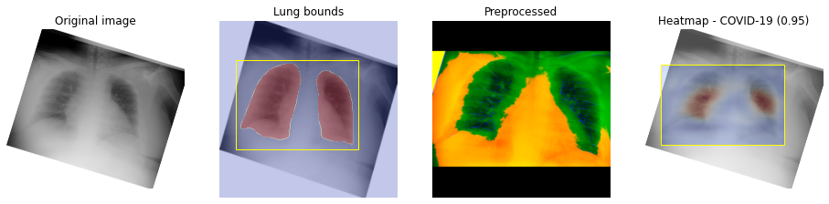
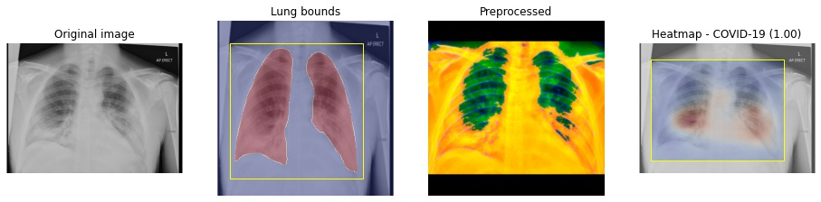
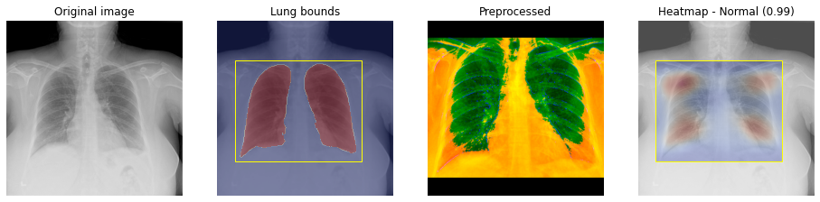
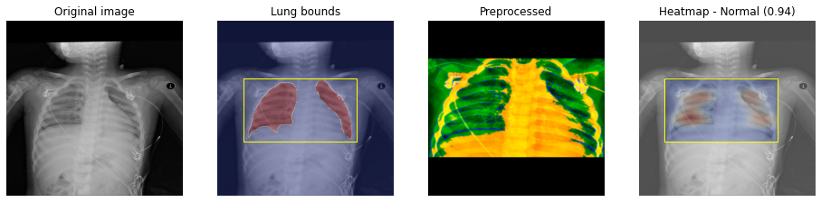
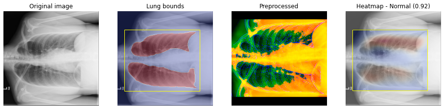

# COVID-19 prediction from Chest X-Rays

**Disclaimer**: The scripts and models presented here have only been tested on a very limited dataset. This repository is not production-ready and is not intended to be used for clinical diagnosis. Please use it responsibly and at your own risk.

This repository is being made available for free, with the hope that it will prove useful to someone during this ongoing global pandemic. Attribution is not required, but will be appreciated, if you find this repository useful.

If you have access to reliable PA/AP Chest X-Ray images, which are not included in the training data listed in the [**Data**](#data) section below, that you would like to share, to help improve this model, please respond [here](https://github.com/singhaxn/COVID-19_CXR_AI/issues/1).

## Inference Pipeline
The inference pipeline uses two models:
1. Segmentation model (unet - resnet34)
1. Classifier (resnet34)

Prediction is performed as follows:
1. Lungs are identified in the input image by the segmentation model
1. The bounding box is computed for the region containing the lungs
1. The input image is cropped and some additional preprocessing is performed on the cropped image (CLAHE, thresholding)
1. A prediction (COVID-19 / Normal / Pneumonia) is obtained from the classifier model, along with an optional heatmap

Here are a few examples, for a visual representation of the steps above







## Results

Confusion matrices for the results produced on two test sets, are given below.

**[Covid-Net](https://github.com/lindawangg/COVID-Net) test set**
<table>
    <tr><th></th><th>COVID-19</th><th>Normal</th><th>Pneumonia</th><th>Sensitivity</th></tr>
    <tr><th>COVID-19</th><td>94</td><td>4</td><td>2</td><td>0.9400</td></tr>
    <tr><th>Normal</th><td>4</td><td>863</td><td>18</td><td>0.9751</td></tr>
    <tr><th>Pneumonia</th><td>5</td><td>46</td><td>543</td><td>0.9141</td></tr>
    <tr><th>P.P.V.</th><td>0.9126</td><td>0.9452</td><td>0.9645</td><td></td></tr>
</table>

**Non-public test set + 20% of RICORD data**
<table>
    <tr><th></th><th>COVID-19</th><th>Normal</th><th>Pneumonia</th><th>Sensitivity</th></tr>
    <tr><th>COVID-19</th><td>117</td><td>1</td><td>0</td><td>0.9915</td></tr>
    <tr><th>Normal</th><td>4</td><td>25</td><td>0</td><td>0.8621</td></tr>
    <tr><th>Pneumonia</th><td>0</td><td>0</td><td>0</td><td>-</td></tr>
    <tr><th>P.P.V.</th><td>0.9669</td><td>0.9615</td><td>-</td><td></td></tr>
</table>

## Environment
The `env` folder contains scripts to help set up an environment, for using the code in this repository, on an Ubuntu 18.04 host. These scripts may work under other debian-based distros as well, but have not been tested. In any case, it should be trivial to adapt these scripts to work under most environments.
- `setup.sh` - This script is meant to be run as root
- `setup-user.sh` - Run this script as the user that will use the repository.  By default, the CPU version of `pytorch` is installed. To install the CUDA (v10.1) version, before running the script, comment out the line:
    ```bash
    pip3 install torch==1.6.0+cpu torchvision==0.7.0+cpu -f https://download.pytorch.org/whl/torch_stable.html
    ```
    and uncomment the line that reads:
    ```bash
    pip3 install torch==1.6.0+cu101 torchvision==0.7.0+cu101 -f https://download.pytorch.org/whl/torch_stable.html
    ```
- `download-models.sh` - Download the latest version of the trained models. This is invoked automatically when you run `setup-user.sh` but is provided as a separate script to simplify acquisition of new models when they become available.

## Prediction
Once the environment is set up correctly, it should be possible to run `inference.py` from the `inference` folder to produce predictions on individual images or folders containing images.
```
python3 inference.py --help
usage: inference.py [-h] --config CONFIG --xraypath XRAYPATH
                    [--heatmappath HEATMAPPATH]

COVID-19_CXR_AI Inference

optional arguments:
  -h, --help            show this help message and exit
  --config CONFIG       Config file path
  --xraypath XRAYPATH   Full path to image (or dir containing images) to be
                        inferenced
  --heatmappath HEATMAPPATH
                        Directory in which generated heatmaps are to be stored
```

Provided that the models are placed in the default location i.e. the `models/current` folder, it should be possible to use the included `model-config.json` file as-is.

Ideally, use full-sized X-Ray images in PNG format.

## Training
Should you wish to train the models further or retrain from scratch, the public data that was used for training is listed in the **Data** section below. The following notebooks can serve as guidelines for training:
- `segmentation/segmentation-train.ipynb`
- `classification/classifier-train.ipynb`

## Data
The notebooks used to create usable datasets for training, are in the `datasets` folder. Please note that these notebooks create hard links to the original images, to avoid duplication. Therefore, it is advisable to put the final datasets on the same logical disk partition, as the original images.

The data used for training, was acquired from the sources listed below.

### Segmentation
- [NLM Tuberculosis Chest X-ray Image Data Sets](https://lhncbc.nlm.nih.gov/publication/pub9931)
- [Shenzhen subset segmentation masks](https://www.kaggle.com/yoctoman/shcxr-lung-mask)
- Additional non-public, manually segmented (using [Fiji](https://imagej.net/Fiji/Downloads)) images

### Classification
Compiled by the [Covid-Net](https://github.com/lindawangg/COVID-Net) team:
- [ieee8023](https://github.com/ieee8023/covid-chestxray-dataset)
- [Figure1](https://github.com/agchung/Figure1-COVID-chestxray-dataset)
- [Actualmed](https://github.com/agchung/Actualmed-COVID-chestxray-dataset)
- [SIRM](https://www.kaggle.com/tawsifurrahman/covid19-radiography-database)
- [RSNA Pneumonia detection challenge](https://www.kaggle.com/c/rsna-pneumonia-detection-challenge)

Additional
- [RICORD](https://www.rsna.org/en/covid-19/COVID-19-RICORD) -> [TCIA](https://public.cancerimagingarchive.net/ncia/home.jsf)
- Local non-public images

To create the training datasets:
1. Download images from the above links
1. Convert DICOM images to PNG using tools of your choice (e.g. `mogrify` or `convert` from `imagemagick`). Please note that `create_COVIDx_v2_RICORD.ipynb` expects the converted RICORD images to retain the original folder structure.
1. Specify appropriate paths in `segmentation-prepare.ipynb` and run the notebook to create training data for segmentation
1. Specify appropriate paths in `create_COVIDx_v2_RICORD.ipynb` and run the notebook to create a Covid-Net style dataset
1. Specify appropriate paths in `segmentation-apply.ipynb` and run the notebook to 
    1. apply segmentation to the classification training images
    1. save lung bounds for all the training images and 
    1. transform the dataset into the expected form for classifier training

## Credits
- The [Covid-Net](https://github.com/lindawangg/COVID-Net) project for their pioneering work in this field and for creating a comprehensive collection of training data